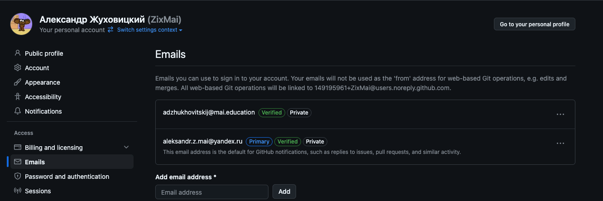
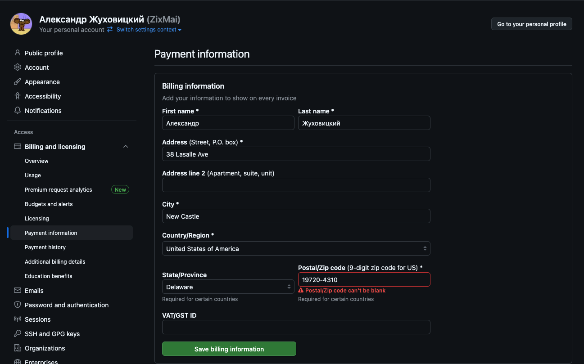
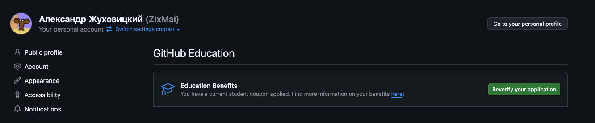
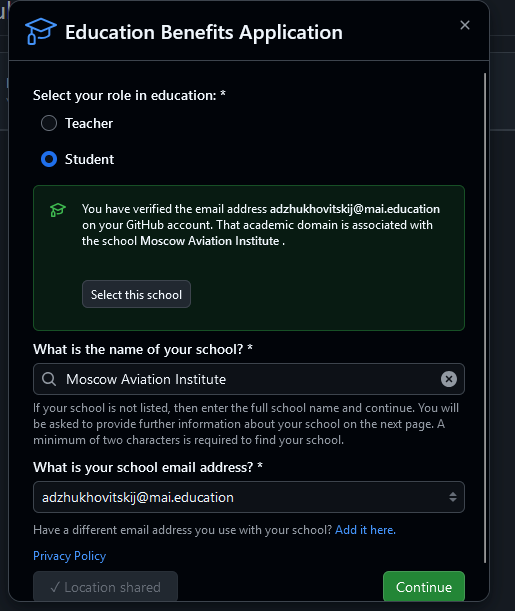
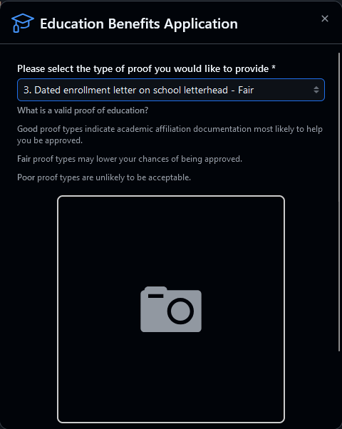
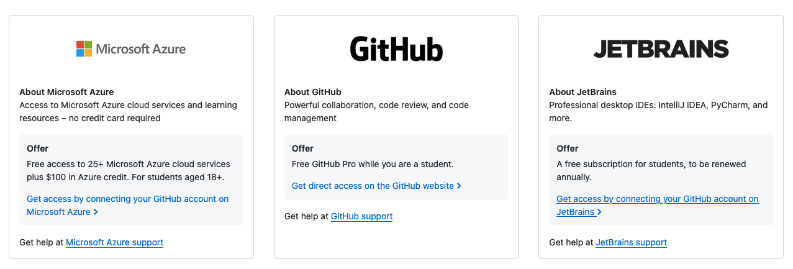
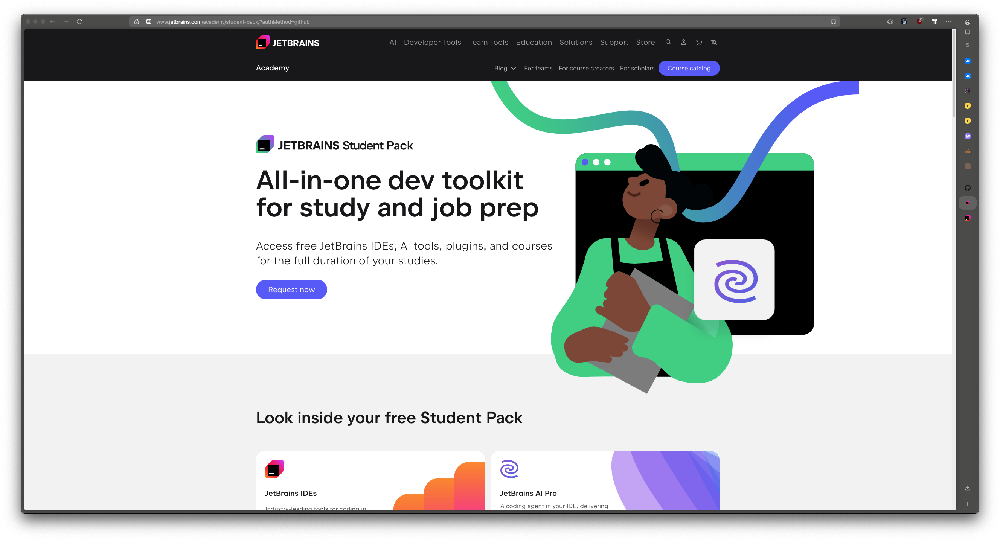

# Инструкция по получению студенческой лицензии JetBrains

Эта инструкция поможет студенту МФТИ _(а может и кому-то еще)_
получить лицензию сразу в двух полезных для программистов сервисах:
[JetBrains](https://jetbrains.com) и [GitHub](https://github.com).

#### Содержание:

1. [Шаг 1. Подготовка](#step-1)
2. [Шаг 2. Получение GitHub Student Developer Pack](#step-2)
3. [Шаг 3. Получение студенческой лицензии JetBrains](#step-3)
4. [Заключение](#conclusion)

## Шаг 1. Подготовка 
Вам понадобится рабочий VPN, сервера которого находятся в странах ЕС и НАТО, например Польша (если у вас с этим проблемы, то можете индивидуально обратиться в [лс ТГ](https://t.me/zixrend)), а также устройство с любой системой КРОМЕ MacOS, а также любой браузер КРОМЕ MS Edge.
Обязательно проверьте ваш VPN сайтом типо 2ip, если VPN не работает, то второго шанса на IDE от JetBrains у вас не будет.

[Привязываем вашу почту в домене @mai.education к GitHub](https://github.com/settings/emails) и подтверждаем её, сообщение на почту может упасть в спам, проверяем.

После привязки должно выглядеть примерно так:

Добавляем на github аккаунт [Two-factor authentication](https://github.com/settings/security).

## Шаг 2. Получение GitHub Student Developer Pack 
Включаем VPN.

С недавнего времени стало необходимо указывать billing information, однако github его не сверяет с вашей геопозицией, поэтому мы можем просто указать реальный адрес какого-нибудь домика, например в США.
Меняем данные по [ссылке](https://github.com/settings/billing/payment_information). Пример, однако попробуйте открыть карты и взять какой-нибудь соседний домик рядом с указанным, но с подходящим индексом и штатом и городом :

Нам нужно получить **GitHub Student Developer Pack**.
Получить его можно по [ссылке](https://github.com/settings/education/benefits). Заходим и нажимаем зелёную кнопочку.
У меня это выглядит так:

В открывемся интерфейсе выбираем, что мы студент и выбираем МАИ, а также в обязательном порядке делимся геопозицией.

Переходим далее и выбираем тип документа с номером 3 как на скриншоте. Далее загружаете фото вашего извещения и пробуете продолжить.

Ваш запрос будет рассмотрен в течение нескольких минут, если что-то не получится, то попробуйте подать заново, но
фото либо переименуйте, либо снимите чуть-чуть под другим ракурсом.

Теперь ваш аккаунт на GitHub имеет привилегию **PRO**,
о чем вы узнаете по соответствующему бейджу в вашем профиле.

Однако для получения education benefits понадобится подождать еще пару дней.

Об остальных привилегиях можно узнать на [сайте](https://education.github.com/pack#offers).
Также вы можете ознакомиться с [оригинальной инструкцией](https://docs.github.com/en/education/explore-the-benefits-of-teaching-and-learning-with-github-education/use-github-for-your-schoolwork/apply-for-a-student-developer-pack),
сделанной командой GitHub.

## Шаг 3. Получение студенческой лицензии JetBrains 

Если вы уже получили education benefits, то время получать лицензию и поскорее переходить к программированию.
Переходим на [сайт github education](https://education.github.com/pack#offers), находим JetBrains и жмём **Get access by connecting your GitHub account on JetBrains**.

Попадаем на страницу jetbrains и жмём **Request now**:

Далее выбираем авторизацию с помощью аккаунта GitHub, на котором вы получили
**Student Developer Pack**:

Далее заполняем анкету, тут уже чужой скриншот, но у меня другого нет. Указываете соотвествующий вам уровень обучения, РЕАЛЬНЫЙ ПОЧТОВЫЙ АДРЕС МАИ, РЕАЛЬНОЕ ИМЯ И ФАМИЛИЮ НА РУССКОМ ЯЗЫКЕ. Далее обязательно выбираете страну, впн которой у вас включён. Затем подаёте анкету и вас почти моментально принимает.

**Apply** и любуемся лицензией у себя в профиле JetBrains:

## Заключение 

С помощью небольших манипуляций у вас получится два полезных аккаунта
с привилегиями студента. С помощью JetBrains вы получите доступ к лучшим
IDE мира, а с помощью аккаунта на GitHub сможете создать себе хорошее
портфолио для будущей работы. Также аккаунт **PRO** позволит в ваших
репозиториях сделать например Wiki. Подробнее [здесь](https://docs.github.com/en/get-started/learning-about-github/githubs-products#github-pro).

**Автор инструкции:** [Артём Фартыгин](https://github.com/temikfart), а также [Александр Жуховицкий](https://github.com/ZixMai)
